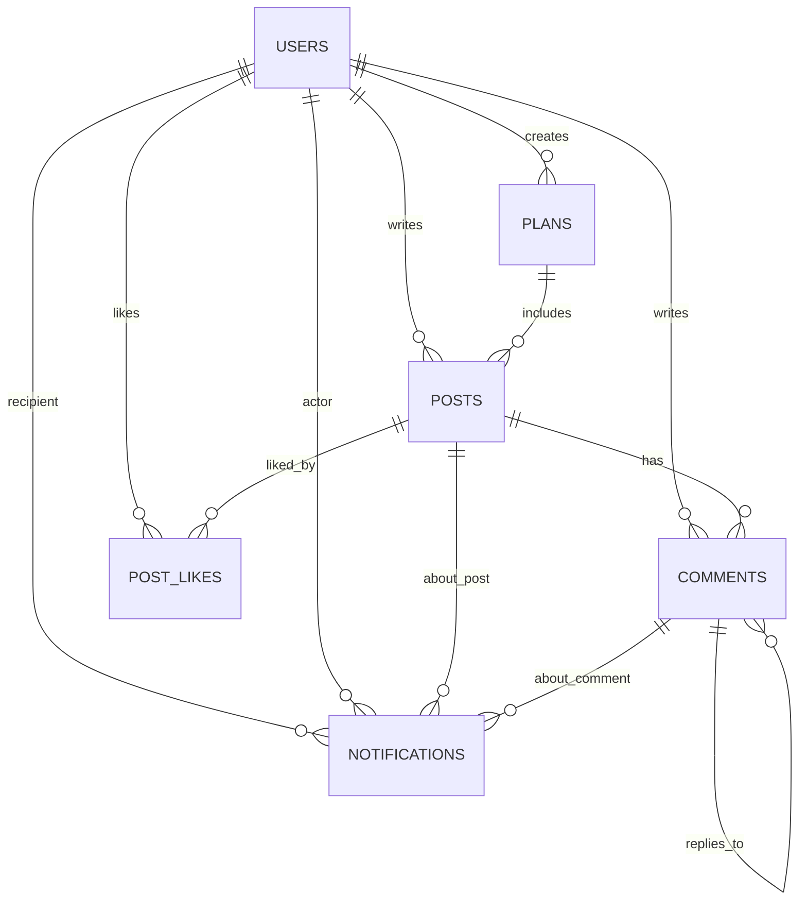

# 数据模型与 Schema (Database Schema)

本系统的数据层基于 MySQL 8.0 设计，通过 Flyway 进行版本化迁移。

## ER 关系图

## 核心表与关键字段语义

### users
*   `role` (UserRole): 用户角色枚举，默认为 `USER`，管理员为 `ADMIN`。
*   `real_name_verification_status` (RealNameVerificationStatus): 实名审核状态。
    *   `PENDING`: 审核中（此时无法发布文章）。
    *   `APPROVED`: 已通过（可发布文章）。
    *   `REJECTED`: 已驳回。

### posts
*   `status` (PostStatus): 文章状态枚举。
    *   `DRAFT`: 草稿，仅作者可见。
    *   `PUBLISHED`: 已发布，全站可见。
    *   `SCHEDULED`: 定时发布，到期自动转为 PUBLISHED。
*   `category` (PostCategory): 文章分类（枚举：如 `PROJECT`, `FRONTEND_BACKEND`, 等）。
*   `plan_id` / `plan_order`: 用于关联到学习/项目计划，并保持计划内的文章顺序。

## 关键索引设计

本系统为提高列表与查询性能，特别是“内网学生可用”的需求，针对列表和搜索场景建立以下核心索引：

*   **全文搜索**: `ft_posts_title_content` ON `posts(title, content) WITH PARSER ngram` (支持中文切词匹配)
*   **列表页排序 (最新发布)**: `idx_posts_status_created` ON `posts(status, created_at)`
*   **分类页排序**: `idx_posts_category_status_created` ON `posts(category, status, created_at)`
*   **个人空间列表**: `idx_posts_author_status_created` ON `posts(author_id, status, created_at)`
*   **定时发布任务**: `idx_posts_status_scheduled` ON `posts(status, scheduled_publish_at)`
*   **计划内文章排序**: `idx_posts_plan_order` ON `posts(plan_id, plan_order)`
*   **评论列表**: `idx_comments_post_created` ON `comments(post_id, created_at)`
*   **通知查询**: `idx_notification_recipient_created` 和 `idx_notification_recipient_read`
