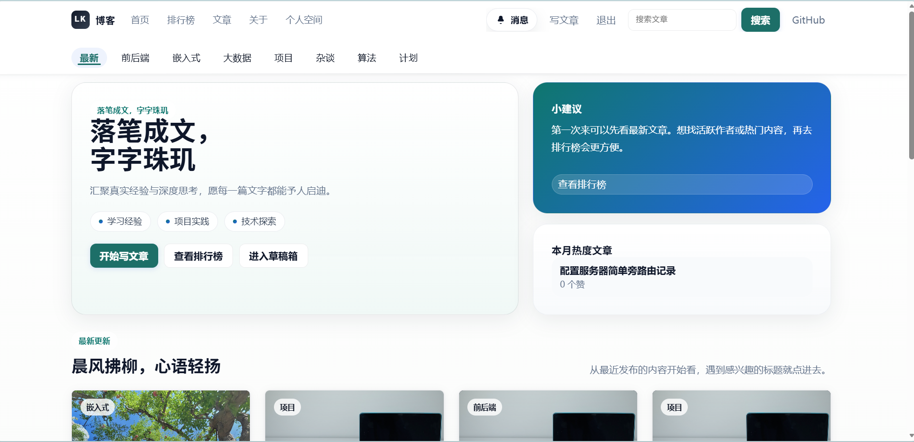
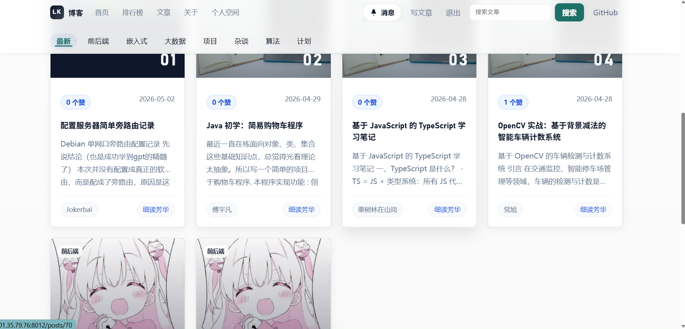
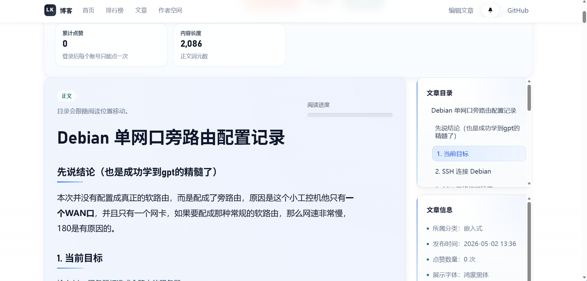
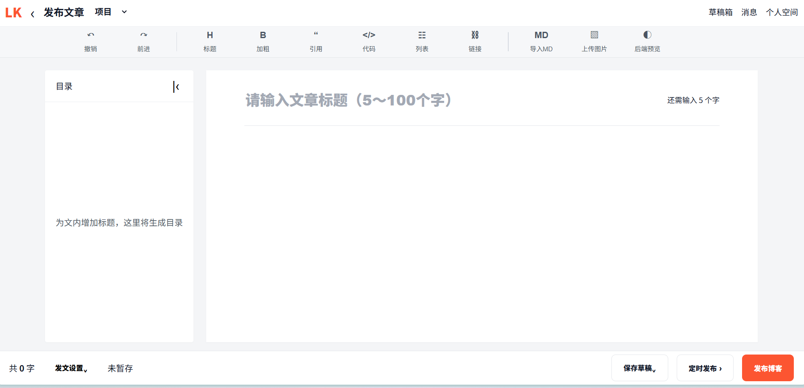

# Blog1 开源博客系统

Blog1 是一个基于 Spring Boot 3、Thymeleaf、Spring Security 和 MySQL 的开源博客系统。它面向所有人开放源码，适合学习、二次开发、个人部署，也适合作为小团队的内容沉淀和协作写作平台。

- 在线展示站点：[http://101.35.79.76:8012/](http://101.35.79.76:8012/)
- 源码仓库：[https://github.com/CjhAIIt/blog](https://github.com/CjhAIIt/blog)
- 开源协议：[Apache License 2.0](LICENSE)
- 原作者声明：[NOTICE](NOTICE)

## 项目展示

### 首页与分类入口



### 文章列表与排行内容



### 文章详情与目录



### Markdown 写作编辑器



## 主要功能

### 内容创作

- 发布、编辑、删除文章
- 草稿箱与草稿续写
- Markdown 实时预览
- Markdown 文件导入为草稿
- 封面图上传、默认封面选择、编辑器图片上传
- 多种文章字体切换
- 定时发布

### 阅读与互动

- 首页推荐、分类浏览、文章列表
- 站内搜索
- 热门文章和创作排行榜
- 点赞、评论、评论回复
- 消息中心与未读提醒

### 个人空间

- 公开个人主页
- 资料编辑与头像上传
- GitHub、个人博客等资料展示
- QQ / GitHub 等敏感字段加密存储
- 个人博客导出

### 计划与后台

- 公开计划、共创计划、我的计划
- 文章归入计划
- 计划进度展示与状态管理
- 实名资料选填和管理员审核
- 管理员文章、用户、认证资料管理

### 前端体验

- 桌面端与移动端模板分别维护
- 按客户端自动切换移动视图
- 注册、登录、文章、计划、排行榜、搜索、个人空间等核心页面已适配移动端

## 技术栈

- Java 17
- Spring Boot 3.2
- Spring MVC
- Spring Data JPA
- Spring Security
- Thymeleaf
- MySQL / MariaDB
- CommonMark + Jsoup
- Maven Wrapper

## 快速启动

### 1. 准备环境

需要安装：

- JDK 17
- MySQL 8.x，或兼容的 MySQL / MariaDB 实例

创建数据库：

```sql
CREATE DATABASE blogdb CHARACTER SET utf8mb4 COLLATE utf8mb4_unicode_ci;
```

### 2. 配置环境变量

开发环境至少建议覆盖数据库连接、敏感字段加密密钥和服务端口。

Windows PowerShell：

```powershell
$env:SPRING_DATASOURCE_URL='jdbc:mysql://127.0.0.1:3306/blogdb?useSSL=false&serverTimezone=Asia/Shanghai&allowPublicKeyRetrieval=true&characterEncoding=UTF-8'
$env:SPRING_DATASOURCE_USERNAME='root'
$env:SPRING_DATASOURCE_PASSWORD='your-password'
$env:APP_SECURITY_FIELD_ENCRYPTION_SECRET='replace-with-your-own-secret'
$env:SERVER_PORT='8012'
```

Linux / macOS：

```bash
export SPRING_DATASOURCE_URL='jdbc:mysql://127.0.0.1:3306/blogdb?useSSL=false&serverTimezone=Asia/Shanghai&allowPublicKeyRetrieval=true&characterEncoding=UTF-8'
export SPRING_DATASOURCE_USERNAME='root'
export SPRING_DATASOURCE_PASSWORD='your-password'
export APP_SECURITY_FIELD_ENCRYPTION_SECRET='replace-with-your-own-secret'
export SERVER_PORT='8012'
```

### 3. 运行测试

```bash
# Windows
.\mvnw.cmd -q test

# Linux / macOS
./mvnw -q test
```

### 4. 启动应用

开发模式：

```bash
# Windows
.\mvnw.cmd spring-boot:run

# Linux / macOS
./mvnw spring-boot:run
```

打包运行：

```bash
# Windows
.\mvnw.cmd -DskipTests package

# Linux / macOS
./mvnw -DskipTests package
```

```bash
java -jar target/blog-0.0.1-SNAPSHOT.jar
```

### 5. 本地访问

- 首页：`http://localhost:8012/`
- 登录：`http://localhost:8012/login`
- 注册：`http://localhost:8012/register`
- 文章列表：`http://localhost:8012/posts`
- 计划页：`http://localhost:8012/plans`
- 个人空间：`http://localhost:8012/space`
- 消息中心：`http://localhost:8012/notifications`

数据库为空时，系统会自动初始化示例账号和示例内容：

- 管理员账号：`admin / password`
- 示例用户：`user / password`

生产环境请务必替换默认密码、配置独立数据库账号，并设置新的 `APP_SECURITY_FIELD_ENCRYPTION_SECRET`。

## 常用配置

| 变量名 | 说明 |
| --- | --- |
| `SPRING_DATASOURCE_URL` | MySQL 连接地址 |
| `SPRING_DATASOURCE_DRIVER_CLASS_NAME` | 数据库驱动，默认 `com.mysql.cj.jdbc.Driver` |
| `SPRING_DATASOURCE_USERNAME` | 数据库用户名 |
| `SPRING_DATASOURCE_PASSWORD` | 数据库密码 |
| `SPRING_JPA_HIBERNATE_DDL_AUTO` | Hibernate DDL 策略，默认 `update` |
| `SPRING_JPA_SHOW_SQL` | 是否打印 SQL，默认 `false` |
| `SERVER_PORT` | 应用端口，默认 `8012` |
| `APP_SCHEMA_COMPATIBILITY_ENABLED` | 是否启用启动时结构兼容修复，默认 `true` |
| `APP_SECURITY_FIELD_ENCRYPTION_SECRET` | 敏感字段加密密钥 |
| `APP_SITE_SOURCE_REPO_URL` | 页面中的源码仓库地址 |
| `APP_STORAGE_UPLOAD_DIR` | 上传文件目录，默认 `./uploads` |

## 数据库与结构维护

当前数据库由 JPA 与启动时兼容修复共同维护：

- `spring.jpa.hibernate.ddl-auto=update`
- `app.schema.compatibility.enabled=true`

启动时会自动处理常见兼容项：

- `posts.content` 升级为 `LONGTEXT`
- `posts.status`、`posts.category` 兼容旧字段类型
- `users.role`、实名审核相关字段自动补齐
- `plans.status` 从旧整数状态迁移到明确字符串状态
- 用户、文章、计划、评论等常用查询索引自动补齐

## 项目结构

```text
src/main/java/com/example/blog
|- config
|- controller
|- dto
|- model
|- repository
`- service

src/main/resources
|- static
|- templates
`- application.properties

src/test/java/com/example/blog
|- config
|- model
`- service
```

## 部署建议

推荐把程序本体和可变内容分开：

```text
/home/blog/
|- blog.jar
|- blog.env
`- uploads/
```

示例 `blog.env`：

```bash
SERVER_PORT=8012
APP_SECURITY_FIELD_ENCRYPTION_SECRET=replace-with-your-own-secret
APP_SITE_SOURCE_REPO_URL=https://github.com/CjhAIIt/blog
SPRING_DATASOURCE_URL=jdbc:mysql://127.0.0.1:3306/blogdb?useSSL=false&serverTimezone=Asia/Shanghai&allowPublicKeyRetrieval=true&characterEncoding=UTF-8
SPRING_DATASOURCE_DRIVER_CLASS_NAME=com.mysql.cj.jdbc.Driver
SPRING_DATASOURCE_USERNAME=blogapp
SPRING_DATASOURCE_PASSWORD=replace-with-your-password
SPRING_JPA_HIBERNATE_DDL_AUTO=update
SPRING_JPA_SHOW_SQL=false
APP_SCHEMA_COMPATIBILITY_ENABLED=true
APP_STORAGE_UPLOAD_DIR=/home/blog/uploads
```

部署时建议保留：

- `uploads/`
- 环境变量文件
- 数据库数据
- 外部反向代理配置

更多部署说明可参考：

- [部署指南](docs/DEPLOYMENT_GUIDE.md)
- [反向代理指南](docs/REVERSE_PROXY_GUIDE.md)
- [SSH 隧道指南](docs/SSH_TUNNEL_GUIDE.md)

## 贡献方式

这个项目面向所有人开源，欢迎通过 Issue 或 Pull Request 参与：

- 提交 Bug 复现步骤
- 补充文档、截图、部署说明
- 优化移动端和桌面端体验
- 增加测试用例
- 提交新功能或重构建议

提交代码前建议先运行：

```bash
.\mvnw.cmd -q test
```

Linux / macOS 环境使用：

```bash
./mvnw -q test
```

## 原作者声明

本项目原作者为 `cjh`（GitHub：`CjhAIIt`），原始仓库为 [CjhAIIt/blog](https://github.com/CjhAIIt/blog)。任何二次分发、修改或公开展示版本请保留本声明以及仓库中的 [NOTICE](NOTICE) 文件。

## 许可证

本项目采用 [Apache License 2.0](LICENSE) 开源协议。你可以在遵守协议的前提下自由使用、复制、修改、分发和再授权本项目。
